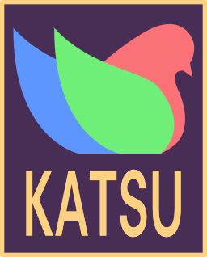

**Katsu** is a light cross-platform C library for 2D video game programming. It 
includes an API for 2D rendering, a simple input system, and raw sound output. 
Tile-map models of old school computers and video game consoles are the basis 
for Katsu's 2D rendering capabilities.


## Features

+ 4bpp 8x8 pixel tile format
+ Background and sprite affine transformations
+ Horizontal line effects
+ Window effects
+ Other old-school effects (Mosaic, palette manipulation, etc.)


## Build from source

To build the library from source, your requirements depend on your operating system.

### Windows

IN PROGRESS

### Debian-based Linux

You will need the development packages for X11, OpenGL, and PulseAudio.

You can download them from your package manager as ```libx11-dev```, ```libgl1-mesa-dev``` 
and ```libpulse-dev```. After they are installed, compile and run from the terminal with:

```
$> gcc <your_source_code> src/*.c src/opengl/*.c src/platform/linux/*.c -o game -lGL -lpthread -lpulse-simple -lX11 -ldl -I../include
$> ./game
```

### RedHat-based Linux

You will need the development packages for X11, OpenGL, and PulseAudio.

You can download them from your package manager as ```libX11-devel```, ```mesa-libGL-devel``` 
and ```pulseaudio-libs-devel```. After this, compile and run from the terminal with:

```
$> gcc <your_source_code> src/*.c src/opengl/*.c src/platform/linux/*.c -o game -lGL -lpthread -lpulse-simple -lX11 -ldl -I../include
$> ./game
```

## Keyboard keys

All Katsu applications use the same 17 keys:

- The four arrow keys and Z, X, C, A, S, D, Q, W, E, R, Enter, and Backspace
- Press Esc to exit form full screen


## Developer Manual

The Katsu Developer Manual will come at a future date.

## Assets

Katsu asks for particular formats; if you want to create assets that follow these 
formats, you must make your own tools (though a Katsu asset builder is planned). 
But there might exist some 4bpp tile editors out there.

## Donation
**The Katsu project is and will always be free!**

If you liked Katsu and you want to support me on its development, you can donate with this button:

[](https://www.paypal.com/donate?hosted_button_id=H9AEAYCDAYCB6)


